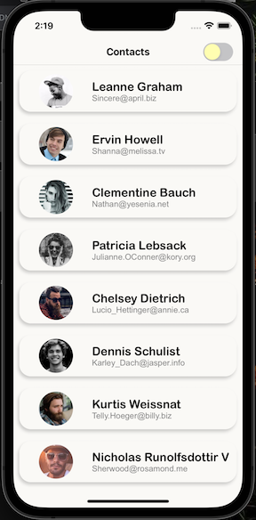
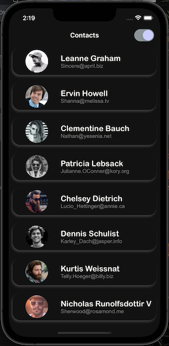
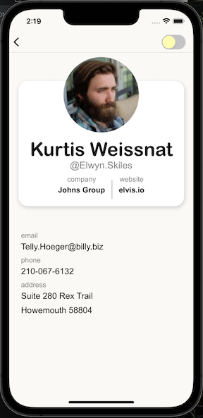
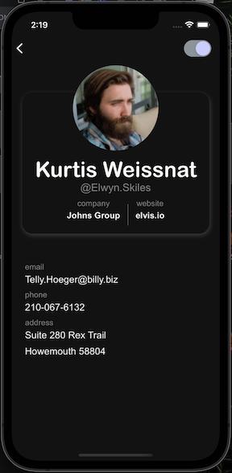
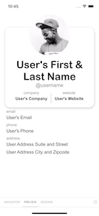

# Users Contact Info App

 
 

[Explore the docs](https://github.com/puakehaulani/takeHomeApp)  
[Expo Snack deployment](https://snack.expo.dev/@puakehaulani/github.com-puakehaulani-takehomeapp)  

---

## Table of Contents

- [About the Project](#About-the-Project)
- [Usage](#Usage)
- [Getting Started](#Getting-Started)
  - [Installation](#Installation)
- [Testing](#Testing)
- [Contributing](#Contributing)
- [License](#License)
- [Questions](#Questions)

## About the Project

A simple mobile app made with React Native to display a list of users.  
Each user in the list has a profile view with extended contact information, accessible by tapping their entry in the list.  
Data is recieved from https://jsonplaceholder.typicode.com/users api, and images are supplied from https://pravatar.cc/ using the user response key as the unique identifier, so the images are not randomly assigned each time.  
Toggle the upper right button to switch from light to dark mode.  
Orientation is currently locked to portrait mode to ensure no unexpected ui changes on orientation change. Later iterations to include a specific landscape design implementation as well as logic to listen for orientation changes.

## Usage

Run the following commands in your terminal

### To run iOS:

Option 1:  
Run Metro Bundler

    yarn start

Open XCode workspace project and press play button to run build

Option 2:  
Start Metro Bundler and launch iOS Simulator without XCode

    yarn ios

### To run Android:

    yarn android

## Getting Started

To get started, follow these steps:

### Installation

Run the following commands in your terminal

    yarn fresh-install

## Testing

Run the following command in your terminal

    yarn test

This app supports Storybook

 
   
To run storybook environment, replace App.js contents with `export default from './storybook';`

## Helpful Comnmands

Remove node modules, build folder, and podfile

    yarn full-clean

## Contributing

Contributions are not currently accepted and app is not actively maintained. Created as a skill sample for interviewing.

## License

This application is covered under the MIT license

## Questions

For any questions, please reach out to <puakehaulani.dev@gmail.com>  
[dev repo](http://github.com/puakehaulani)
|
[dev website](http://lexi.scalesdev.com)
